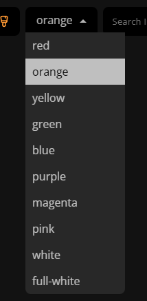

# Accented

A lightweight theme for [Spicetify](https://github.com/spicetify) that replaces Spotify's green with a color of your choice.


> [!NOTE]
> This repository was a fork of https://github.com/updxg/accented at [576f539a8e9099e1e8bad137b19f47fd52fb1c51](https://github.com/updxg/accented/commit/576f539a8e9099e1e8bad137b19f47fd52fb1c51). It has been detached from the fork network to ensure it shows up in Spicetify's searches since they don't include forks.

This theme was originally created by [@luximus-hunter](https://github.com/luximus-hunter) in Feb of 2022, survived by [@updxg](https://github.com/updxg)'s fork (among others) after it was deleted or privated, then updated to reappear on the marketplace on this fork. This fork also includes some additional fixes & improvements.

## Color options

- Red
- Orange
- Yellow
- Green
- Blue
- Purple
- Magenta
- Pink
- White
- Full White (also hearts)

## Installation

**Spicetify Marketplace** (recommended)

Install the theme though the [Spicetify Marketplace](https://github.com/spicetify/marketplace). This will allow you to change the color quickly in-app.



**Linux and MacOS** in Bash:

```bash
cd "$(dirname "$(spicetify -c)")/Themes"
git clone https://github.com/JWWolstenholme/accented
spicetify config current_theme accented
spicetify config color_scheme <color scheme name>
spicetify apply
```

**Windows** in Powershell:

```powershell
cd "$(spicetify -c | Split-Path)\Themes"
git clone https://github.com/JWWolstenholme/accented
spicetify config current_theme accented
spicetify config color_scheme <color scheme name>
spicetify apply
```

## Development

1. Install and activate the theme manually (not via the marketplace) with the instructions above
1. Install [npm](https://www.npmjs.com/)
1. Install [sass](https://sass-lang.com/): `npm install -g sass`
1. Run `spicetify watch -s` to reload spotify when `user.css` is modified
1. Edit [`user.scss`](/user.scss). **Not** `user.css`
1. Run `sass --no-source-map user.scss:user.css` to compile and output to the [`user.css`](/user.css) file
